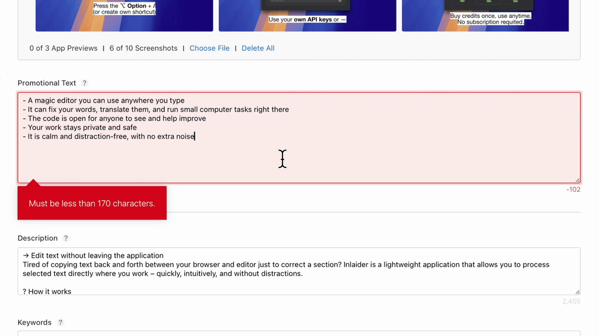

# Inlaider

**Inlaider** is a humble macOS app that lets you quickly process selected text with AI—without leaving the context of your current application.

---

## How it works

| Action | What happens |
|--------|--------------|
| **⌥ Option + /** (default shortcut) | Opens input assistant window with the currently selected text. If the app lacks **Accessibility** permission, the clipboard content is used instead. |
| **Type a command** | Examples: `translate into English`, `add emoji`, `shorten`. |
| **Enter** | The text is processed by the AI model. |
| **Enter** (when the command field is empty) | The result is returned to the source field (with **Accessibility** permission) or copied to the clipboard. |

---

## Requirements

- **macOS 15** or newer
- (Optional) **Accessibility** permission — allows automatic insertion of text back into the field from which it was taken.

---

## Keyboard flow (quick workflow)

1. Select the text in an input field.
2. Press **⌥ Option + /**.
3. Type the command → **Enter**.
4. Press **Enter** again to insert the result or copy it to the clipboard.

---

## Privacy

Inlaider does not store any history of processed texts and only sends data to the selected AI model provider during the user request.
